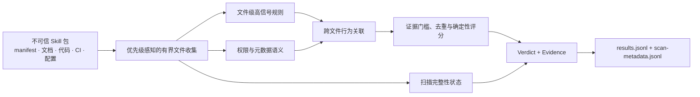

<div align="center">

# Agent Skill Security Scanner

### 在执行 Agent Skill 之前，先验证它真正会做什么

面向 Agent Skill、MCP 工具、IDE 规则与插件供应链的离线、确定性、可解释静态安全扫描器。

[](https://github.com/daffnjk/agent-skill-security-scanner/actions/workflows/ci.yml)
[](go.mod)
[](Dockerfile)
[](https://github.com/daffnjk/agent-skill-security-scanner/tree/main)
[](https://github.com/daffnjk/agent-skill-security-scanner/tree/competition/v38-final)
[](LICENSE)

[项目定位](#项目定位) · [版本路线](#版本路线) · [基准指标](#基准指标) · [快速开始](#快速开始) · [输出与退出语义](#输出与退出语义) · [检测范围](#检测范围) · [竞赛成绩](#竞赛成绩) · [English](README_EN.md)

</div>

`skillscan` 将待测 Skill 作为**不可信数据**处理：不安装、不导入、不执行其中的脚本，也不访问包内声明的 URL。扫描器联合分析 manifest、代码、文档、CI 工作流、Dockerfile、Agent/MCP 配置及项目自动运行配置，识别分散在多个文件中的恶意行为链、权限与实际行为矛盾，以及供应链和跨平台迁移风险。

当前 `main` 是基于比赛 v38 版本持续演进的开发主线。它保留兼容的四字段 `results.jsonl`，同时增加扫描完整性元数据和 fail-closed 语义：读取失败、资源截断、符号链接或不透明载荷导致扫描不完整时，对应 Skill 不会继续保持 `benign`，默认进程会在写出结果后以退出码 `3` 结束。

仓库采用“持续演进主线 + 冻结比赛基线”的双轨结构：`main` 用于当前开发，`competition/v38-final` 用于精确复现比赛代码。版本化数据集指标统一保存在 [`benchmarks/`](benchmarks/README.md)，便于后续版本按相同数据源、样本口径和 `(suite, dataset_id)` 主键进行逐项对比。

> [!IMPORTANT]
> **比赛原始版本与当前开发版本严格分离。** `competition/v38-final` 固定保存最终参赛快照；README 中的 **7.27 / 10** 赛事成绩只对应该快照，不代表当前 `main` 已获得赛事重新评测。

> [!NOTE]
> 这是启发式静态分析工具。结果用于定位安全评审线索，不能替代沙箱、来源校验、签名验证、运行时监控和人工审查。

## 项目定位

该项目主要解决“在安装或执行一个 Agent Skill 之前，先判断它实际具备什么能力、是否存在隐藏行为，以及扫描本身是否完整”这一问题。

适合用于：

- Agent Skill、MCP Server、IDE 规则和插件包的安装前审计；
- CI 中的离线安全检查与不完整扫描阻断；
- 安全研究、规则回归和数据集评测；
- 隔离环境中的批量预筛和人工复核前线索生成。

它不是运行时沙箱、终端防护或恶意代码执行环境，也不应作为执行不可信 Skill 的唯一依据。

## 核心能力

| 能力 | 说明 |
| --- | --- |
| **行为链检测** | 关联凭据读取、网络外传、命令执行、安装钩子、动态加载和权限声明，避免只凭单个关键词下结论 |
| **跨文件分析** | 联合 manifest、代码、文档、CI、Dockerfile 与 IDE/Agent 配置，还原分散在多个文件中的风险链路 |
| **扫描完整性** | 记录读取错误、预算截断、采样文件、符号链接和不透明载荷；不完整扫描不能继续输出可信 `benign` |
| **结构化权限判断** | 对合法 JSON 权限声明进行结构化解析，降低描述文本、显式 `false` 和重复信号造成的误判 |
| **可解释输出** | 为非良性结果选择一个主 `AST01`–`AST10` 类别，并输出相关文件与行为证据 |
| **离线、确定性** | 单个 Go 二进制，无外部 API 和模型权重；固定规则顺序保证相同输入产生稳定输出 |
| **有界资源使用** | 限制单文件、单 Skill 文本量和文件对象数量，并优先保留 manifest、生命周期、CI 和源代码材料 |
| **安全扫描方式** | 将待测包作为数据读取，不执行其中的脚本，也不访问其中声明的网络地址 |

## 版本路线

| 分支 | 定位 | 维护策略 |
| --- | --- | --- |
| [`competition/v38-final`](https://github.com/daffnjk/agent-skill-security-scanner/tree/competition/v38-final) | 最终参赛版本的冻结快照，提交 `4d78e38` | 只用于复现比赛代码、成绩和历史基准，不接受后续功能合并 |
| [`main`](https://github.com/daffnjk/agent-skill-security-scanner/tree/main) | 当前稳定迭代主线 | 接收赛后代码质量、安全语义、检测能力、测试和发布工程改进 |
| `feature/*`、`fix/*`、`docs/*` | 单项开发分支 | 从 `main` 创建，经 CI 和 Pull Request 合回 `main` |

后续版本会明确标注为“基于 v38 的赛后迭代”，不会把新版本能力或测试结果追溯套用到原始比赛成绩上。

## 基准指标

仓库将检测器代码版本与数据集评测快照分开记录，避免把赛事官方分数、赛后数据集结果和当前主线能力混为一谈。

首个可比较快照是 [`benchmarks/v38/`](benchmarks/v38/README.md)：

| 评测套件 | 评估单元 | 实际扫描 | 说明 |
| --- | ---: | ---: | --- |
| 本地 malicious-skills corpus | 13 | 63,707 | 11 个单元完成；2 个只有元数据，未伪造检测结果 |
| PoisonedSkills | 1 | 1,070 | 890 个判为 `malicious`，180 个漏检；严格召回率 83.18%，F2 86.07% |

完整逐数据集指标见 [`metrics.csv`](benchmarks/v38/metrics.csv)，检测器哈希、构建环境和数据源固定版本见 [`manifest.json`](benchmarks/v38/manifest.json)。不同数据集存在样本重叠，且部分单元只有恶意正样本，因此不报告跨数据集总分；后续版本应新增独立目录，不覆盖历史快照。

## 快速开始

需要 Go 1.23 或更高版本：

```bash
git clone https://github.com/daffnjk/agent-skill-security-scanner.git
cd agent-skill-security-scanner

make build
make test
make selftest
```

输入目录下每个子目录代表一个 Skill：

```text
skills/
├── calendar-helper/
│   ├── SKILL.md
│   └── manifest.json
└── code-reviewer/
    ├── package.json
    └── index.js
```

执行扫描：

```bash
mkdir -p out
./skillscan ./skills ./out

cat ./out/results.jsonl
cat ./out/scan-metadata.jsonl
```

也可以使用 `SKILLS_DIR` 和 `OUTPUT_DIR` 指定路径；命令行位置参数优先。

### Docker

```bash
docker build -t skillscan:local .

mkdir -p out
docker run --rm \
  -v "$PWD/skills:/data/skills:ro" \
  -v "$PWD/out:/output" \
  skillscan:local
```

运行镜像基于 BusyBox，进程使用非 root UID 1000。Docker 和 `make release` 支持通过目标架构参数构建不同平台的二进制。

## 输出与退出语义

### `results.jsonl`

每个 Skill 输出一行兼容比赛协议的 JSON：

```json
{"skill_id":"chain-supply-update","verdict":"malicious","engine_category":"ast02","evidence_text":"OWASP AST02 ..."}
```

| 字段 | 说明 |
| --- | --- |
| `skill_id` | 输入目录名 |
| `verdict` | `benign`、`suspicious` 或 `malicious` |
| `engine_category` | 主 `ast01`–`ast10` 类别；良性时为 `benign` |
| `evidence_text` | 行为依据、相关文件上下文或扫描完整性警告 |

### `scan-metadata.jsonl`

扫描器同时输出每个 Skill 的完整性状态，包括：

- 是否完整、是否因资源预算而截断；
- 已访问、已分析和已跳过的文件数量；
- 读取错误与有限的错误样例；
- 大文件采样、符号链接和不透明可执行文件或归档的统计。

两份结果都先写入临时文件，再原子提交，降低进程中断留下半截输出的风险。

### 退出码

| 退出码 | 含义 |
| ---: | --- |
| `0` | 扫描流程完整结束；发现 `suspicious` 或 `malicious` 本身不会改变退出码 |
| `2` | 输入、输出或启动阶段错误 |
| `3` | 至少一个 Skill 扫描不完整；结果和完整性元数据已经写出 |

兼容只消费旧比赛 JSONL 的环境时，可以显式设置：

```bash
SKILLSCAN_ALLOW_PARTIAL=1 ./skillscan ./skills ./out
```

该选项只放宽进程退出码，不会删除完整性警告，也不会让不完整扫描重新变成可信 `benign`。

## 检测范围

| 类别 | 风险 | 代表性检测内容 |
| --- | --- | --- |
| `AST01` | Malicious Skills | 凭据、浏览器、钱包、云令牌和工作区数据外传；反向连接；持久化；诱导 Agent 执行命令 |
| `AST02` | Supply Chain Compromise | 安装/构建钩子、可变版本、替代注册源、依赖混淆、CI 下载执行、项目自动运行配置 |
| `AST03` | Over-Privileged Skills | 过宽的文件、网络、Shell、主机、容器或敏感数据权限，并区分显式关闭的权限 |
| `AST04` | Insecure Metadata | 隐藏指令、双向控制字符、HTML/CSS 隐写、工具描述注入、声明与行为矛盾、品牌冒充 |
| `AST05` | Unsafe Deserialization | YAML/Pickle/node-serialize 类危险载荷、原型污染、可影响执行的配置注入 |
| `AST06` | Weak Isolation | Docker Socket、特权容器、基础设施控制面、本地 Agent/MCP 控制劫持 |
| `AST07` | Update Drift | 远程插件、配置、manifest 或 module 热加载；扫描后的自更新与完整性漂移 |
| `AST08` | Poor Scanning | 编码重构结合 `eval`/`exec`、远程加载或数据外传的规避链；扫描器完整性异常 |
| `AST09` | No Governance | 审计、清单、批准和日志缺失；主要作为治理类修饰证据 |
| `AST10` | Cross-Platform Reuse | 平台迁移时安全元数据丢失、权限扩大、凭据或会话材料复用和策略弱化 |

`suspicious` 中间态用于区分“存在风险或设计缺陷”与“具有明确恶意行为链”。

## 工作原理



扫描器先验证输入并按安全优先级收集受支持文件，再提取文件级信号、重建跨文件行为链并选择主 AST 类别。完整性状态与内容判定并行传播：即使没有命中恶意规则，只要扫描未完成，也不会生成无条件的良性结论。

详细规则和演进记录见 [docs/design.md](docs/design.md)。

## 工程特性

| 项目 | 当前 `main` 实现 |
| --- | --- |
| 实现语言 | Go 1.23+ |
| 第三方 Go module | 0 |
| 外部 API / 模型权重 | 0 / 0 |
| 单文件保留上限 | 1 MiB，头尾采样并记录采样状态 |
| 单 Skill 文本保留上限 | 24 MiB |
| 单 Skill 文件对象上限 | 4,096 |
| 扫描完整性输出 | `scan-metadata.jsonl` |
| 不完整扫描默认行为 | 非良性结果、完整性警告、退出码 `3` |
| CI | 格式检查、`go vet`、覆盖率、race、自测、构建和容器构建 |
| 运行方式 | 本地二进制或 Docker；运行期无需联网 |

历史 v38 合成基准为 4,000 个 Skill 约 3.8 秒、最大 RSS 约 21.5 MiB。该数据只描述冻结的比赛版本，受硬件和语料结构影响；部署当前 `main` 前应重新运行本地基准，详见 [PERFORMANCE.md](PERFORMANCE.md)。

## 竞赛成绩

本项目起源于 **2026 首届火山引擎 AI 安全攻防挑战赛 · 赛道 B（蓝队检测挑战）**。最终参赛版本为 **v38 / recall micro-loop 115**，现冻结在 [`competition/v38-final`](https://github.com/daffnjk/agent-skill-security-scanner/tree/competition/v38-final)，对应提交 `4d78e38f50a1195139827150de70406008af5b5c`。

| 检测质量 | 可解释性 | 运行稳健性 | 性能 | 总分 | 最终排名 |
| ---: | ---: | ---: | ---: | ---: | ---: |
| 4.34 / 5.50 | 1.10 / 2.00 | 0.83 / 1.50 | 1.00 / 1.00 | **7.27 / 10** | **20+** |

复现比赛代码：

```bash
git switch competition/v38-final
```

当前 `main` 包含赛后 fail-closed、规则正确性、确定性、测试和构建工程改进，尚未接受同一赛事环境的重新评测，因此不能把上述成绩视为当前版本指标。评分口径、版本对应关系和公开来源见 [docs/competition.md](docs/competition.md)。

## 测试与开发

```bash
go test ./...
bash scripts/selftest.sh
make verify
```

自测包含恶意链、可疑配置、相邻良性对照、缺失输入、不透明载荷和扫描完整性场景。测试数据只作为文本读取，不会被执行。

后续开发从 `main` 创建 `feature/*`、`fix/*` 或 `docs/*` 分支，通过 CI 和 Pull Request 合并；不要向 `competition/v38-final` 回合并新代码。

- [设计与规则演进](docs/design.md)
- [赛事成绩与版本边界](docs/competition.md)
- [性能与资源边界](PERFORMANCE.md)
- [自测覆盖](SELFTEST.md)
- [贡献指南](CONTRIBUTING.md)
- [安全问题报告](SECURITY.md)

配套的可追溯评测数据目录见 [`agent-skill-security-datasets`](https://github.com/daffnjk/agent-skill-security-datasets)。

版本化检测指标见 [`benchmarks/`](benchmarks/README.md)；首个快照为 [`v38`](benchmarks/v38/README.md)，后续版本沿用相同 CSV 键和指标口径进行逐数据集对比。

## 已知边界

- 静态规则和行为链分析可能产生误报或漏报。
- 加密、动态生成、深度混淆、二进制或暂不支持的内容可能无法被完整解释。
- 对不透明载荷、符号链接、读取错误和资源截断，扫描器会报告不完整，而不是声称已完成全面检查。
- `benign` 不代表安全保证，也不应作为执行不可信 Skill 的唯一依据。
