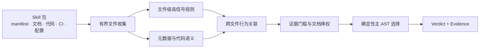

<div align="center">

# Agent Skill Security Scanner

### 在执行 Skill 之前，先看清它会做什么

面向 Agent Skill、MCP 工具包、IDE 规则与插件包的离线静态安全扫描器。

[](https://github.com/daffnjk/agent-skill-security-scanner/actions/workflows/ci.yml)
[](go.mod)
[](Dockerfile)
[](LICENSE)

[快速开始](#快速开始) · [核心能力](#核心能力) · [检测范围](#检测范围) · [工作原理](#工作原理) · [竞赛成绩](#竞赛成绩) · [English](README_EN.md)

</div>

`skillscan` 在**不安装、不导入、不执行**待测包的前提下，联合分析 manifest、代码、文档、CI、容器配置和项目自动运行配置，识别跨文件行为链、元数据与实际行为的矛盾，以及 Agent Skill 供应链中的常见风险。

每个 Skill 输出 `benign`、`suspicious` 或 `malicious` 判定，并附带一个主 OWASP Agentic Skills Top 10 类别和可复核证据。扫描器由纯 Go 实现，不依赖外部 API、模型权重或第三方 Go module，适合本地审计、CI 门禁和隔离环境。

> [!IMPORTANT]
> 这是启发式静态分析工具。结果用于定位安全评审线索，不能替代沙箱、来源校验、签名验证和人工审查。

## 核心能力

| 能力 | 说明 |
| --- | --- |
| **行为链检测** | 关联凭据读取、网络外传、命令执行、安装钩子、动态加载与权限声明，避免只凭单个关键词下结论 |
| **跨文件分析** | 联合 manifest、代码、文档、CI、Dockerfile 与 IDE/项目配置，还原分散在多个文件中的风险链路 |
| **可解释输出** | 为非良性结果选择一个主 `AST01`–`AST10` 类别，并输出相关文件与行为证据 |
| **离线、确定性** | 单个 Go 二进制，无外部 API 和模型权重；相同输入产生稳定输出 |
| **有界资源使用** | 限制单文件、单 Skill 文本量和文件对象数量，跳过二进制、归档、依赖目录与常见缓存 |
| **安全扫描方式** | 将待测包作为数据读取，不执行其中的脚本，也不访问其中声明的 URL |

## 快速开始

需要 Go 1.23 或更高版本：

```bash
git clone https://github.com/daffnjk/agent-skill-security-scanner.git
cd agent-skill-security-scanner

make build
make test
make selftest
```

输入目录下每个子目录代表一个 Skill：

```text
skills/
├── calendar-helper/
│   ├── SKILL.md
│   └── manifest.json
└── code-reviewer/
    ├── package.json
    └── index.js
```

执行扫描：

```bash
mkdir -p out
./skillscan ./skills ./out
cat ./out/results.jsonl
```

也可以使用 `SKILLS_DIR` 和 `OUTPUT_DIR` 指定路径；命令行位置参数优先。

### Docker

```bash
docker build -t skillscan:local .

mkdir -p out
docker run --rm \
  -v "$PWD/skills:/data/skills:ro" \
  -v "$PWD/out:/output" \
  skillscan:local
```

运行镜像基于 BusyBox，进程使用非 root UID 1000。

## 输出格式

每个 Skill 输出一行 JSON：

```json
{"skill_id":"chain-supply-update","verdict":"malicious","engine_category":"ast02","evidence_text":"OWASP AST02 ..."}
```

| 字段 | 说明 |
| --- | --- |
| `skill_id` | 输入目录名 |
| `verdict` | `benign`、`suspicious` 或 `malicious` |
| `engine_category` | 主 `ast01`–`ast10` 类别；良性时为 `benign` |
| `evidence_text` | 行为依据与相关文件上下文 |

结果先写入临时文件，再原子提交为 `results.jsonl`，降低中途失败留下不完整输出的风险。

扫描器同时写入 `scan-metadata.jsonl`，记录每个 Skill 的扫描完整性、读取错误、资源截断、采样文件以及跳过的链接或不透明载荷。默认情况下，只要存在不完整扫描，进程在完整写出两份结果后以退出码 `3` 结束，并且对应 Skill 不会保持 `benign`。兼容只消费 JSONL 的旧评测环境时，可显式设置 `SKILLSCAN_ALLOW_PARTIAL=1`；完整性警告仍会保留在结果和元数据中。

## 检测范围

| 类别 | 风险 | 代表性检测内容 |
| --- | --- | --- |
| `AST01` | Malicious Skills | 凭据、浏览器、钱包、云令牌和工作区数据外传；反向连接；持久化；诱导 Agent 执行命令 |
| `AST02` | Supply Chain Compromise | 安装/构建钩子、可变版本、替代注册源、依赖混淆、CI 下载执行、项目自动运行配置 |
| `AST03` | Over-Privileged Skills | 过宽的文件、网络、Shell、主机、容器或敏感数据权限，并区分显式关闭的权限 |
| `AST04` | Insecure Metadata | 隐藏指令、双向控制字符、HTML/CSS 隐写、工具描述注入、声明与行为矛盾、品牌冒充 |
| `AST05` | Unsafe Deserialization | YAML/Pickle/node-serialize 类危险载荷、原型污染、可影响执行的配置注入 |
| `AST06` | Weak Isolation | Docker Socket、特权容器、基础设施控制面、本地 Agent/MCP 控制劫持 |
| `AST07` | Update Drift | 远程插件、配置、manifest 或 module 热加载；扫描后的自更新与完整性漂移 |
| `AST08` | Poor Scanning | 编码重构后结合 `eval`/`exec`、远程加载或数据外传的规避链 |
| `AST09` | No Governance | 审计、清单、批准和日志缺失；仅作为弱修饰证据，不单独驱动恶意判定 |
| `AST10` | Cross-Platform Reuse | 平台迁移时安全元数据丢失、权限扩大、凭据/会话材料复用和策略弱化 |

`suspicious` 中间态用于区分“存在风险或设计缺陷”与“具有明确恶意行为链”。

## 工作原理



扫描器先限制输入规模，再提取文件级信号并重建跨文件行为链。较宽松的召回路径只有在强证据和最低类别分数同时满足时，才能把良性结果提升为可疑或恶意；最终按确定性规则选择一个主 AST 类别。

详细规则与版本演进见 [docs/design.md](docs/design.md)。

## 工程特性

| 项目 | 当前实现 |
| --- | --- |
| 实现语言 | Go 1.23+ |
| 第三方 Go module | 0 |
| 外部 API / 模型权重 | 0 / 0 |
| 单文件保留上限 | 1 MiB，头尾采样 |
| 单 Skill 文本保留上限 | 24 MiB |
| 单 Skill 文件对象上限 | 4,096 |
| 运行方式 | 本地二进制或 Docker；运行期无需联网 |

历史 v38 合成基准为 4,000 个 Skill 约 3.8 秒、最大 RSS 约 21.5 MiB。该数据受硬件和语料结构影响，部署前请用自己的数据重新测试，详见 [PERFORMANCE.md](PERFORMANCE.md)。

## 竞赛成绩

本项目起源于 **2026 首届火山引擎 AI 安全攻防挑战赛 · 赛道 B（蓝队检测挑战）**。当前开源基线为赛事最终提交版本 **v38 / recall micro-loop 115**。

| 检测质量 | 可解释性 | 运行稳健性 | 性能 | 总分 | 最终排名 |
| ---: | ---: | ---: | ---: | ---: | ---: |
| 4.34 / 5.50 | 1.10 / 2.00 | 0.83 / 1.50 | 1.00 / 1.00 | **7.27 / 10** | **20+** |

评分口径、版本对应关系和公开来源见 [docs/competition.md](docs/competition.md)。

## 测试与文档

```bash
go test ./...
bash scripts/selftest.sh
```

自测包含恶意链、可疑配置和相邻良性对照；测试数据只作为文本读取，不会被执行。

- [设计与规则演进](docs/design.md)
- [赛事成绩与评分口径](docs/competition.md)
- [性能与资源边界](PERFORMANCE.md)
- [自测覆盖](SELFTEST.md)
- [贡献指南](CONTRIBUTING.md)
- [安全问题报告](SECURITY.md)

配套的可追溯评测数据目录见 [`agent-skill-security-datasets`](https://github.com/daffnjk/agent-skill-security-datasets)。

## 已知边界

- 静态规则和行为链分析可能产生误报或漏报。
- 加密、动态生成、深度混淆、二进制载荷或暂不支持的格式可能逃逸检测。
- `benign` 不代表安全保证，也不应作为执行不可信 Skill 的唯一依据。

