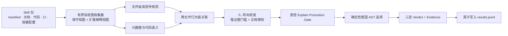

<div align="center">

# Agent Skill Security Scanner

### 面向 Agent Skill 供应链的离线、可解释、多层静态检测引擎

**2026 首届火山引擎 AI 安全攻防挑战赛 · 赛道 B 最终提交版本：总分 `7.27 / 10`，最终排名 `20+`。现完整开源 。**

[](https://github.com/daffnjk/agent-skill-security-scanner/actions/workflows/ci.yml)
[](#最终竞赛成绩)
[](#最终竞赛成绩)
[](go.mod)
[](Dockerfile)
[](#输出格式)
[](LICENSE)

[最终成绩](#最终竞赛成绩) · [快速开始](#快速开始) · [竞争力](#为什么值得关注) · [检测范围](#检测范围) · [架构](#检测架构) · [English](README_EN.md)

</div>

`skillscan` 用于在**不安装、不导入、不执行**待测包的前提下，审计 AI Agent Skills、MCP 风格工具包、IDE 规则和插件包。它不依赖外部 API 或模型权重，而是通过**文件级信号、跨文件行为链、元数据—代码矛盾、受控召回提升与根因 AST 分类**，输出可复现的三态判定和证据。

> [!IMPORTANT]
> 这是启发式静态分析工具。检测结果应作为安全评审线索，而不是“安全”或“恶意”的最终证明。不要为了验证告警而直接执行不可信 Skill。

## 最终竞赛成绩

> [!NOTE]
> **本仓库当前开源的 v38 / recall micro-loop 115，就是赛事截止时提交并获得下列成绩的最终版本，不是赛后重写版或未经官方复评的后续版本。**

| 评分维度 | 官方权重 | 最终加权得分 | 该维度满分 | 按公布分值折算 |
| --- | ---: | ---: | ---: | ---: |
| 检测质量 | 55% | **4.34** | 5.50 | 约 78.9% |
| 可解释性 | 20% | **1.10** | 2.00 | 55.0% |
| 运行稳健性 | 15% | **0.83** | 1.50 | 约 55.3% |
| 性能 | 10% | **1.00** | 1.00 | **100%** |
| **总分** | **100%** | **7.27** | **10.00** | **72.7%** |

**最终排名：20+。** 四项加权分值相加为 `4.34 + 1.10 + 0.83 + 1.00 = 7.27`。

这组结果也清晰体现了项目的工程画像：性能维度拿到满分，检测质量是总分的主要贡献项；可解释性和运行稳健性则是公开版本后续最值得继续量化改进的方向。这里公开的是实际比赛结果，不把本地合成测试或赛后设想包装成官方成绩。

## 为什么值得关注

| 能力 | 本项目的实现 |
| --- | --- |
| **行为链检测，而非单词命中** | 将凭据读取、外传、命令执行、安装钩子、动态加载、权限声明等信号关联起来，降低“看到可疑词就报恶意”的误报 |
| **跨文件关联** | 联合分析 manifest、代码、文档、CI、容器与项目自动运行配置，识别单文件中不完整、跨文件后才成立的攻击链 |
| **离线且确定性** | 纯 Go 单二进制，无第三方 Go module、无外部 API、无模型权重、运行期不出网；相同输入得到稳定输出 |
| **F₂ 导向但有边界** | 针对安全场景的召回需求进行高信号补强，同时使用强证据门槛、文档/测试降权和受控 promotion gate 抑制泛化误报 |
| **可解释根因分类** | 非良性结果输出单一主 `AST01`–`AST10` 类别和对应 `evidence_text`，避免只给出无法复核的二分类结论 |
| **资源上界与故障隔离** | 单文件、单 Skill 总文本量和文件数量均有限制；逐 Skill 捕获内部解析异常；结果采用临时文件加原子提交 |
| **竞赛约束下的工程实现** | 支持 `/data/skills/{skill_id}/` → `/output/results.jsonl`，BusyBox 运行时，非 root `USER 1000` |
| **最终参赛版本可复核** | 开源代码与最终提交版本均为 v38 / loop 115，最终总分、分项分值和排名在本页明确披露 |

### 可核验的工程指标

| 项目 | 当前实现 |
| --- | --- |
| 实现语言 | Go 1.23+ |
| 第三方 Go module | 0 |
| 外部 API / 模型权重 | 0 / 0 |
| 输出模式 | `benign` / `suspicious` / `malicious` |
| 主分类 | `benign` 或 `ast01`–`ast10` |
| 单文件读取上限 | 1 MiB，保留头尾采样 |
| 单 Skill 保留文本上限 | 24 MiB |
| 单 Skill 文件对象上限 | 4,096 |
| 历史 v38 合成基准 | 4,000 个 Skill 约 3.8 秒，最大 RSS 约 21.5 MiB* |

\* 该数据来自 v38 的定向合成语料，受硬件和样本结构影响，不是赛事官方性能分值；部署前请按自己的数据重新测试。详见 [PERFORMANCE.md](PERFORMANCE.md)。

## 竞赛背景与版本演进

本项目起源于 **首届火山引擎 AI 安全攻防挑战赛（2026）· 赛道 B（蓝队检测挑战）**。该赛道要求选手提交 Docker 化 Skill 检测引擎，在隐藏的黑、白、灰样本上同时衡量：

- **检测质量 55%**：以更重视召回率的 F₂ 为核心；
- **性能 10%**：检测速度与 Token 效率；
- **可解释性 20%**：主 OWASP AST 类别的精确匹配；
- **运行稳健性 15%**：异常处理、完成率与资源稳定性。

项目选择了一条明确的技术路线：**不用联网 LLM 换取判断能力，而是在严格资源约束内，把静态行为语义、跨文件关联、AST 根因选择和可复现输出做到足够深。**

### 最终提交前的版本演进

| 阶段 | 版本定位 | 关键变化 |
| --- | --- | --- |
| v32–v35 | 稳定性与特异性加固 | 双视图文件收集、受控召回提升、UTF-16/边缘格式、权限布尔语义、原子输出 |
| v36–v37 | F₂ 边缘召回加固 | 凭据外传、WebSocket C2、本地 Agent 控制、供应链与 CI 自动执行、跨平台元数据损失 |
| **v38 / loop 115** | **赛事最终提交版本，也是当前开源基线** | IDE/项目自动运行劫持、远程可变构建入口、编码规避、品牌冒充、Rust 等语言外传链与证据前缀统一；最终 **7.27 / 10，排名 20+** |

完整规则演进见 [docs/design.md](docs/design.md)，赛事成绩与披露边界见 [docs/competition.md](docs/competition.md)，发布记录见 [CHANGELOG.md](CHANGELOG.md)。

## 检测架构



核心原则：

1. **先限制输入，再做检测**：跳过二进制、归档、依赖目录和常见缓存；对大文件保留头尾采样。
2. **先找具体行为，再做标签**：文件级发现携带类别、权重、路径、原因与强证据标记。
3. **跨文件重建攻击链**：例如 manifest 声明权限、脚本读取凭据、网络代码完成外传。
4. **召回提升必须有门槛**：扩展视图只能用具体高信号链把良性结果提升为可疑或恶意。
5. **输出单一根因**：按确定性分数和校准逻辑选择主 AST 类别，并生成可人工复核的证据。

## 检测范围

| 类别 | 风险 | 代表性检测内容 |
| --- | --- | --- |
| `AST01` | Malicious Skills / 恶意 Skill | 凭据、浏览器、钱包、云令牌、工作区数据外传；反向连接；持久化；Agent 指令诱导 |
| `AST02` | Supply Chain Compromise / 供应链破坏 | 安装与构建钩子、可变版本、替代注册源、依赖混淆、CI 远程下载执行、项目自动运行配置 |
| `AST03` | Over-Privileged Skills / 过度授权 | 广泛文件、网络、Shell、主机、容器或个人数据权限；区分显式 `false` 与真正启用的危险权限 |
| `AST04` | Insecure Metadata / 不安全元数据 | 隐藏指令、双向控制字符、HTML/CSS 隐写、工具描述注入、风险声明与运行行为矛盾、品牌冒充 |
| `AST05` | Unsafe Deserialization / 不安全反序列化 | YAML/Pickle/node-serialize 类危险载荷、原型污染、可影响执行敏感选项的配置注入 |
| `AST06` | Weak Isolation / 弱隔离 | Docker Socket、特权容器、Kubernetes/Redis/etcd/Vault 等本地或基础设施控制面、Agent/MCP 本地控制劫持 |
| `AST07` | Update Drift / 更新漂移 | 热加载远程插件、配置/manifest/module 动态更新、扫描通过后的自更新或完整性漂移 |
| `AST08` | Poor Scanning / 扫描规避 | Base64、hex、Unicode、URL 编码等重构后结合 `eval`/`exec`、远程加载或外传的规避链 |
| `AST09` | No Governance / 缺少治理 | 审计、清单、批准与日志缺失信号；当前作为弱修饰证据，避免治理关键词单独驱动恶意判定 |
| `AST10` | Cross-Platform Reuse / 跨平台复用风险 | 平台迁移时安全元数据丢失、权限扩大、可复用凭据/会话材料及策略弱化 |

项目刻意避免把“漏洞”“过度权限”“可疑设计”全部等同于作者恶意，因此保留 `suspicious` 中间态。

## 快速开始

### 本地构建

要求 Go 1.23 或更高版本：

```bash
git clone https://github.com/daffnjk/agent-skill-security-scanner.git
cd agent-skill-security-scanner

make build
make test
make selftest
```

扫描一个按目录组织的 Skill 集合：

```text
skills/
├── calendar-helper/
│   ├── SKILL.md
│   └── manifest.json
└── code-reviewer/
    ├── package.json
    └── index.js
```

```bash
mkdir -p out
./skillscan ./skills ./out
cat ./out/results.jsonl
```

也可以通过 `SKILLS_DIR` 和 `OUTPUT_DIR` 指定路径；命令行位置参数优先。

### Docker

```bash
docker build -t skillscan:local .

mkdir -p out
docker run --rm \
  -v "$PWD/skills:/data/skills:ro" \
  -v "$PWD/out:/output" \
  skillscan:local
```

运行阶段使用 BusyBox，进程以非 root UID 1000 执行。扫描器本身不会执行 Skill 内的脚本或访问其中的 URL。

## 输出格式

每个输入目录输出一行 JSON：

```json
{"skill_id":"chain-supply-update","verdict":"malicious","engine_category":"ast02","evidence_text":"OWASP AST02 ..."}
```

| 字段 | 说明 |
| --- | --- |
| `skill_id` | 输入目录名 |
| `verdict` | `benign`、`suspicious` 或 `malicious` |
| `engine_category` | 主 `ast01`–`ast10` 类别，良性时为 `benign` |
| `evidence_text` | 简洁的行为依据和相关文件上下文 |

输出先写入临时文件，再提交为 `results.jsonl`，避免中途失败留下半行或不完整结果。

## 适用场景

- Agent Skill / 插件市场的发布前静态筛查；
- 企业引入第三方 Skill 前的本地安全评审；
- CI 中对 Skill、MCP 配置、IDE 规则和项目自动运行配置进行门禁；
- 批量数据集回归、规则质量评测与误报分析；
- 无法访问外网或不允许调用云端模型的隔离环境。

配套的可追溯评测数据目录见 [`agent-skill-security-datasets`](https://github.com/daffnjk/agent-skill-security-datasets)。

## 自测与复现

```bash
go test ./...
bash scripts/selftest.sh
```

自测样例使用惰性字符串、示例域名和临时目录；扫描器只读取文本，不执行其中命令。测试同时包含恶意链与相邻良性对照，用于避免新增规则只提高召回却破坏特异性。

- 规则演进与阈值设计：[docs/design.md](docs/design.md)
- 性能和资源边界：[PERFORMANCE.md](PERFORMANCE.md)
- 自测覆盖：[SELFTEST.md](SELFTEST.md)
- 贡献规则：[CONTRIBUTING.md](CONTRIBUTING.md)
- 漏洞报告：[SECURITY.md](SECURITY.md)

## 已知边界

- 静态字符串与行为链分析仍可能产生误报和漏报。
- 加密、动态生成、深度混淆、二进制载荷或不支持的格式可能逃逸检测。
- `benign` 不代表安全保证，也不能替代沙箱、来源校验、签名验证和人工评审。
- 项目不包含赛事隐藏样本、标准答案、内部评测数据或未公开材料。

## 开源与声明

本项目采用 [MIT License](LICENSE)。

这是参赛者独立维护的非官方开源项目，不代表火山引擎、赛事主办方或 OWASP 的立场，也未获得这些组织的背书。仓库中的风险分类用于检测结果组织与解释；第三方名称仅用于兼容性和安全研究说明。

赛事背景来源：[赛事官网](https://skill-ctf.clsadp.com/)；赛道规模与最高分来源：[公开赛后复盘](https://security.zone.ci/secarticles/wx/547105.html)。

安全研究与规则贡献请遵守 [CONTRIBUTING.md](CONTRIBUTING.md) 和 [SECURITY.md](SECURITY.md)。
