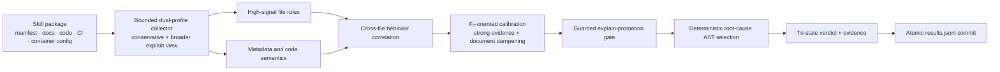

<div align="center">

# Agent Skill Security Scanner

### Offline, explainable, multi-layer static analysis for the Agent Skill supply chain

**Evolved from a prototype ranked in the 20s on a public-stage leaderboard of Track B in the inaugural 2026 Volcengine AI Security Challenge into the reproducible v38 / recall micro-loop 115 open-source engine.**

[](https://github.com/daffnjk/agent-skill-security-scanner/actions/workflows/ci.yml)
[](go.mod)
[](Dockerfile)
[](#output)
[](LICENSE)

[Quick start](#quick-start) · [Why it stands out](#why-it-stands-out) · [Coverage](#coverage) · [Competition origin](#competition-origin-and-evolution) · [Architecture](#architecture) · [中文](README.md)

</div>

`skillscan` audits AI Agent Skills, MCP-style tool packages, IDE rules, and plugin bundles **without installing, importing, or executing them**. It uses file-level signals, cross-file behavior chains, metadata-to-code contradictions, guarded recall promotion, and deterministic root-cause AST selection to emit reproducible tri-state verdicts with evidence—without an external API or model weights.

> [!IMPORTANT]
> This is a heuristic static-analysis tool. Findings are review leads, not final proof that a package is safe or malicious. Never execute an untrusted Skill merely to validate an alert.

## Why it stands out

| Capability | Implementation |
| --- | --- |
| **Behavior chains, not isolated keywords** | Correlates credential access, exfiltration sinks, command execution, install hooks, dynamic loading, and permission declarations |
| **Cross-file analysis** | Connects manifests, code, documentation, CI workflows, container files, and project auto-run configuration |
| **Offline and deterministic** | A single Go binary, zero third-party Go modules, no external API, no model weights, and no runtime network requirement |
| **Recall-oriented with controls** | F₂-driven high-signal additions are constrained by strong-evidence thresholds, document/test dampening, and a guarded promotion gate |
| **Explainable root cause** | Emits one primary `AST01`–`AST10` category and human-readable evidence for every non-benign result |
| **Bounded resources and failure containment** | Per-file, per-skill, and blob-count limits; per-skill parser recovery; atomic result-file commit |
| **Competition-compatible I/O** | `/data/skills/{skill_id}/` to `/output/results.jsonl`, BusyBox runtime, and non-root `USER 1000` |

### Verifiable engineering facts

| Item | Current implementation |
| --- | --- |
| Language | Go 1.23+ |
| Third-party Go modules | 0 |
| External APIs / model weights | 0 / 0 |
| Verdicts | `benign` / `suspicious` / `malicious` |
| Primary category | `benign` or `ast01`–`ast10` |
| Per-file retained data | Up to 1 MiB, sampled from head and tail |
| Per-skill retained text | Up to 24 MiB |
| Per-skill retained blobs | Up to 4,096 |
| Historical v38 synthetic benchmark | 4,000 skills in about 3.8 seconds, about 21.5 MiB max RSS* |

\* Historical, hardware- and corpus-specific, and not an official competition score. Re-benchmark on your own workload. See [PERFORMANCE.md](PERFORMANCE.md).

## Competition origin and evolution

The project began in **Track B (Blue Team Detection Challenge) of the inaugural 2026 Volcengine AI Security Challenge**. Public post-event materials report **617 blue-team entrants**, about **7,200 submitted engine packages**, and a top track score of **8.74**. Entrants submitted Dockerized Skill scanners evaluated on hidden benign, suspicious, and malicious samples across:

- **55% detection quality**, centered on recall-weighted F₂;
- **10% performance**, including runtime and token efficiency;
- **20% explainability**, based on exact primary OWASP AST category matching;
- **15% runtime robustness**, including completion and failure handling.

The technical choice was deliberate: instead of depending on an online LLM, the engine goes deep on static behavior semantics, cross-file correlation, deterministic AST selection, and reproducible output under strict resource constraints.

### From a public-leaderboard rank in the 20s to the v38 open-source baseline

| Stage | Positioning | Public result / status | Main changes |
| --- | --- | --- | --- |
| Initial competition build | Working contest prototype | **Entered the 20s on a public-stage leaderboard during the competition** | Established F₂-oriented verdicting, tri-state output, AST classification, and standard JSONL |
| v32–v35 | Robustness and specificity | Continued post-contest iteration | Dual-profile collection, guarded promotion, UTF-16 and edge formats, boolean permission semantics, atomic output |
| v36–v37 | F₂ edge-recall hardening | Continued post-contest iteration | Credential exfiltration, WebSocket C2, local agent control, CI/supply-chain execution, cross-platform metadata loss |
| **v38 / loop 115** | Current open-source baseline | **Not presented as an official re-score** | IDE/project auto-run hijacking, mutable build entrypoints, encoding evasion, brand impersonation, Rust/non-Python exfiltration, clearer evidence prefixes |

The public-stage rank in the 20s is preserved as the project's honest starting point. It is not used to imply that the later open-source build received an official re-evaluation. No exact personal score is stated because the repository materials available for this documentation update did not include a verifiable score record.

See [docs/design.md](docs/design.md), [docs/competition.md](docs/competition.md), and [CHANGELOG.md](CHANGELOG.md).

## Architecture



The scanner first bounds input, then extracts concrete findings, reconstructs cross-file chains, permits broader-view promotion only with strong evidence, and finally emits one deterministic root-cause category.

## Coverage

| Category | Risk | Representative coverage |
| --- | --- | --- |
| `AST01` | Malicious Skills | Credential, browser, wallet, cloud-token, and workspace exfiltration; reverse channels; persistence; agent-facing execution lures |
| `AST02` | Supply Chain Compromise | Install/build hooks, mutable versions, alternate registries, dependency confusion, CI download-and-execute, project auto-run config |
| `AST03` | Over-Privileged Skills | Broad filesystem, network, shell, host, container, or sensitive-data permissions, with explicit-false handling |
| `AST04` | Insecure Metadata | Hidden instructions, bidi/control text, HTML/CSS concealment, tool-description injection, metadata/runtime contradictions, brand impersonation |
| `AST05` | Unsafe Deserialization | YAML/Pickle/node-serialize-style payloads, prototype pollution, and execution-sensitive config injection |
| `AST06` | Weak Isolation | Docker socket, privileged containers, infrastructure control planes, and local Agent/MCP control hijacking |
| `AST07` | Update Drift | Remote plugin/config/manifest/module hot reload, self-update after scanning, and integrity drift |
| `AST08` | Poor Scanning | Encoded reconstruction combined with eval/exec, remote loading, or exfiltration |
| `AST09` | No Governance | Missing audit, inventory, approval, and logging signals used as weak modifiers rather than standalone malicious drivers |
| `AST10` | Cross-Platform Reuse | Security-metadata loss, widened target permissions, reusable credential/session material, and policy weakening across platforms |

The scanner retains a `suspicious` state so that vulnerable or over-privileged design is not automatically equated with malicious intent.

## Quick start

Requires Go 1.23 or later:

```bash
git clone https://github.com/daffnjk/agent-skill-security-scanner.git
cd agent-skill-security-scanner

make build
make test
make selftest
```

Scan a directory containing one subdirectory per Skill:

```text
skills/
├── calendar-helper/
│   ├── SKILL.md
│   └── manifest.json
└── code-reviewer/
    ├── package.json
    └── index.js
```

```bash
mkdir -p out
./skillscan ./skills ./out
cat ./out/results.jsonl
```

`SKILLS_DIR` and `OUTPUT_DIR` are also supported; positional arguments take precedence.

### Docker

```bash
docker build -t skillscan:local .

mkdir -p out
docker run --rm \
  -v "$PWD/skills:/data/skills:ro" \
  -v "$PWD/out:/output" \
  skillscan:local
```

The runtime stage uses BusyBox and UID 1000. The scanner reads package content as data; it does not execute embedded commands or contact package URLs.

## Output

One JSON object is emitted for each input directory:

```json
{"skill_id":"chain-supply-update","verdict":"malicious","engine_category":"ast02","evidence_text":"OWASP AST02 ..."}
```

| Field | Meaning |
| --- | --- |
| `skill_id` | Input directory name |
| `verdict` | `benign`, `suspicious`, or `malicious` |
| `engine_category` | Primary `ast01`–`ast10` category, or `benign` |
| `evidence_text` | Concise behavioral basis with relevant file context |

Output is written to a temporary file and committed as `results.jsonl` to reduce partial-result corruption.

## Use cases

- Pre-publication scanning for Skill or plugin registries;
- Local review before enterprise adoption of third-party Skills;
- CI gates for Skills, MCP configuration, IDE rules, and project auto-run configuration;
- Dataset regression, rule-quality evaluation, and false-positive analysis;
- Isolated environments where cloud APIs and model calls are not allowed.

The companion traceable dataset catalog is [`agent-skill-security-datasets`](https://github.com/daffnjk/agent-skill-security-datasets).

## Tests and reproducibility

```bash
go test ./...
bash scripts/selftest.sh
```

Fixtures use inert strings, example domains, and temporary directories. Tests include both malicious chains and nearby benign controls so that recall improvements do not silently destroy specificity.

- Design and rule evolution: [docs/design.md](docs/design.md)
- Performance and resource bounds: [PERFORMANCE.md](PERFORMANCE.md)
- Self-test coverage: [SELFTEST.md](SELFTEST.md)
- Contribution policy: [CONTRIBUTING.md](CONTRIBUTING.md)
- Vulnerability reporting: [SECURITY.md](SECURITY.md)

## Limitations

- Static string and behavior-chain analysis can produce false positives and false negatives.
- Encrypted, dynamically generated, deeply obfuscated, binary, or unsupported content may evade inspection.
- A `benign` verdict is not a security guarantee and does not replace sandboxing, provenance checks, signature verification, or human review.
- The repository does not contain hidden competition samples, answer keys, internal evaluation data, or unpublished material.

## License and independence

Licensed under the [MIT License](LICENSE).

This is an independently maintained, unofficial participant project. It does not represent or imply endorsement by Volcengine, the competition organizers, or OWASP. Third-party names are used only for compatibility and security-research context.

Competition context: [event website](https://skill-ctf.clsadp.com/); participation and top-score figures: [public post-event recap](https://security.zone.ci/secarticles/wx/547105.html).
