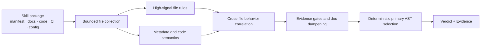

<div align="center">

# Agent Skill Security Scanner

### Understand what a Skill does before you run it

Offline static security analysis for Agent Skills, MCP tool packages, IDE rules, and plugin bundles.

[](https://github.com/daffnjk/agent-skill-security-scanner/actions/workflows/ci.yml)
[](go.mod)
[](Dockerfile)
[](LICENSE)

[Quick start](#quick-start) · [Core capabilities](#core-capabilities) · [Coverage](#coverage) · [How it works](#how-it-works) · [Competition result](#competition-result) · [中文](README.md)

</div>

`skillscan` audits manifests, code, documentation, CI workflows, container files, and project auto-run configuration **without installing, importing, or executing the package**. It detects cross-file behavior chains, contradictions between metadata and runtime behavior, and common Agent Skill supply-chain risks.

Each Skill receives a `benign`, `suspicious`, or `malicious` verdict, one primary OWASP Agentic Skills Top 10 category, and reviewable evidence. The scanner is written in Go, has no external API, model-weight, or third-party Go module dependency, and works well for local review, CI gates, and isolated environments.

> [!IMPORTANT]
> This is a heuristic static-analysis tool. Findings are security-review leads, not a replacement for sandboxing, provenance checks, signature verification, or human review.

## Core capabilities

| Capability | What it provides |
| --- | --- |
| **Behavior-chain detection** | Correlates credential access, exfiltration, command execution, install hooks, dynamic loading, and permission declarations instead of judging isolated keywords |
| **Cross-file analysis** | Connects manifests, code, docs, CI, Dockerfiles, and IDE/project configuration to reconstruct distributed risk chains |
| **Explainable results** | Selects one primary `AST01`–`AST10` category for each non-benign result and reports relevant files and behavioral evidence |
| **Offline and deterministic** | A single Go binary with no external API or model weights; identical input produces stable output |
| **Bounded resource use** | Caps per-file and per-Skill text plus retained file count; skips binaries, archives, dependency trees, and common caches |
| **Safe inspection** | Reads packages as data, does not execute embedded scripts, and does not contact package-declared URLs |

## Quick start

Requires Go 1.23 or later:

```bash
git clone https://github.com/daffnjk/agent-skill-security-scanner.git
cd agent-skill-security-scanner

make build
make test
make selftest
```

Each child directory under the input path represents one Skill:

```text
skills/
├── calendar-helper/
│   ├── SKILL.md
│   └── manifest.json
└── code-reviewer/
    ├── package.json
    └── index.js
```

Run a scan:

```bash
mkdir -p out
./skillscan ./skills ./out
cat ./out/results.jsonl
```

`SKILLS_DIR` and `OUTPUT_DIR` are also supported; positional arguments take precedence.

### Docker

```bash
docker build -t skillscan:local .

mkdir -p out
docker run --rm \
  -v "$PWD/skills:/data/skills:ro" \
  -v "$PWD/out:/output" \
  skillscan:local
```

The runtime image uses BusyBox and runs as non-root UID 1000.

## Output

The scanner emits one JSON object per Skill:

```json
{"skill_id":"chain-supply-update","verdict":"malicious","engine_category":"ast02","evidence_text":"OWASP AST02 ..."}
```

| Field | Meaning |
| --- | --- |
| `skill_id` | Input directory name |
| `verdict` | `benign`, `suspicious`, or `malicious` |
| `engine_category` | Primary `ast01`–`ast10` category, or `benign` |
| `evidence_text` | Behavioral basis and relevant file context |

Results are written to a temporary file and atomically committed as `results.jsonl` to reduce partial-output corruption.

The scanner also writes `scan-metadata.jsonl` with per-Skill completeness, read errors, resource truncation, sampled files, skipped links, and opaque payloads. By default, any incomplete scan still writes both files and then exits with status `3`; the affected Skill cannot remain `benign`. Legacy ranking harnesses may explicitly set `SKILLSCAN_ALLOW_PARTIAL=1`, while the warning remains present in the result and metadata.

## Coverage

| Category | Risk | Representative coverage |
| --- | --- | --- |
| `AST01` | Malicious Skills | Credential, browser, wallet, cloud-token, and workspace exfiltration; reverse channels; persistence; agent-facing execution lures |
| `AST02` | Supply Chain Compromise | Install/build hooks, mutable versions, alternate registries, dependency confusion, CI download-and-execute, project auto-run config |
| `AST03` | Over-Privileged Skills | Broad filesystem, network, shell, host, container, or sensitive-data permissions, with explicit-false handling |
| `AST04` | Insecure Metadata | Hidden instructions, bidi/control text, HTML/CSS concealment, tool-description injection, metadata/runtime contradictions, brand impersonation |
| `AST05` | Unsafe Deserialization | YAML/Pickle/node-serialize-style payloads, prototype pollution, and execution-sensitive config injection |
| `AST06` | Weak Isolation | Docker socket, privileged containers, infrastructure control planes, and local Agent/MCP control hijacking |
| `AST07` | Update Drift | Remote plugin/config/manifest/module hot reload, post-scan self-update, and integrity drift |
| `AST08` | Poor Scanning | Encoded reconstruction combined with `eval`/`exec`, remote loading, or exfiltration |
| `AST09` | No Governance | Missing audit, inventory, approval, and logging signals used as weak modifiers rather than standalone malicious drivers |
| `AST10` | Cross-Platform Reuse | Security-metadata loss, widened target permissions, reusable credential/session material, and policy weakening across platforms |

The `suspicious` state separates risky or vulnerable design from a concrete malicious behavior chain.

## How it works



The scanner bounds input first, extracts file-level signals, and reconstructs behavior across files. A broader recall path may promote a benign result only when strong evidence and a minimum category score are both present. Deterministic rules then select one primary AST category.

See [docs/design.md](docs/design.md) for rule design and version history.

## Engineering properties

| Item | Current implementation |
| --- | --- |
| Language | Go 1.23+ |
| Third-party Go modules | 0 |
| External APIs / model weights | 0 / 0 |
| Per-file retained data | Up to 1 MiB, sampled from head and tail |
| Per-Skill retained text | Up to 24 MiB |
| Per-Skill retained files | Up to 4,096 |
| Runtime | Local binary or Docker; no network required |

The historical v38 synthetic benchmark scanned 4,000 Skills in about 3.8 seconds with about 21.5 MiB maximum RSS. Hardware and corpus structure affect this result; benchmark your own workload before deployment. See [PERFORMANCE.md](PERFORMANCE.md).

## Competition result

The project originated in **Track B (Blue Team Detection Challenge) of the inaugural 2026 Volcengine AI Security Challenge**. The current open-source baseline is the final competition submission, **v38 / recall micro-loop 115**.

| Detection quality | Explainability | Runtime robustness | Performance | Total | Final rank |
| ---: | ---: | ---: | ---: | ---: | ---: |
| 4.34 / 5.50 | 1.10 / 2.00 | 0.83 / 1.50 | 1.00 / 1.00 | **7.27 / 10** | **20+** |

See [docs/competition.md](docs/competition.md) for scoring definitions, version provenance, and public sources.

## Tests and documentation

```bash
go test ./...
bash scripts/selftest.sh
```

The self-test includes malicious chains, suspicious configurations, and nearby benign controls. Fixtures are read as inert text and are never executed.

- [Design and rule evolution](docs/design.md)
- [Competition result and scoring](docs/competition.md)
- [Performance and resource limits](PERFORMANCE.md)
- [Self-test coverage](SELFTEST.md)
- [Contribution guide](CONTRIBUTING.md)
- [Security reporting](SECURITY.md)

The companion traceable dataset catalog is [`agent-skill-security-datasets`](https://github.com/daffnjk/agent-skill-security-datasets).

## Limitations

- Static rules and behavior-chain analysis can produce false positives and false negatives.
- Encrypted, dynamically generated, deeply obfuscated, binary, or unsupported content may evade inspection.
- A `benign` verdict is not a security guarantee or sufficient reason to execute an untrusted Skill.

