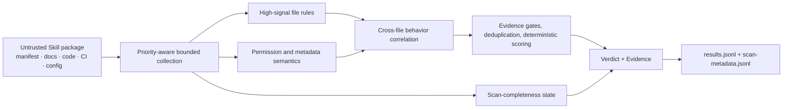

<div align="center">

# Agent Skill Security Scanner

### Verify what an Agent Skill actually does before you run it

Offline, deterministic, and explainable static security analysis for Agent Skills, MCP tools, IDE rules, and plugin supply chains.

[](https://github.com/daffnjk/agent-skill-security-scanner/actions/workflows/ci.yml)
[](go.mod)
[](Dockerfile)
[](https://github.com/daffnjk/agent-skill-security-scanner/tree/main)
[](https://github.com/daffnjk/agent-skill-security-scanner/tree/competition/v38-final)
[](LICENSE)

[Positioning](#project-positioning) · [Quick start](#quick-start) · [Output and exit semantics](#output-and-exit-semantics) · [Coverage](#coverage) · [Version model](#version-model) · [Competition result](#competition-result) · [中文](README.md)

</div>

`skillscan` treats every package as **untrusted data**. It does not install, import, or execute embedded scripts, and it does not contact URLs declared by the package. The scanner correlates manifests, source code, documentation, CI workflows, Dockerfiles, Agent/MCP configuration, and project auto-run files to identify distributed malicious behavior, metadata/runtime contradictions, supply-chain risks, and cross-platform security regressions.

The current `main` branch is the actively maintained post-competition line built on the v38 submission. It preserves the compatible four-field `results.jsonl` output while adding scan-completeness metadata and fail-closed behavior: when read failures, resource truncation, symbolic links, or opaque payloads make a scan incomplete, the affected Skill cannot remain `benign`, and the process exits with status `3` after writing its results by default.

> [!IMPORTANT]
> **The original competition implementation and current development line are intentionally separate.** `competition/v38-final` permanently preserves the final submission snapshot. The published **7.27 / 10** competition score applies only to that snapshot and does not imply that the current `main` branch has been re-evaluated by the competition.

> [!NOTE]
> This is a heuristic static-analysis tool. Findings are security-review leads, not a replacement for sandboxing, provenance checks, signature verification, runtime monitoring, or human review.

## Project positioning

The project addresses a practical question: before installing or executing an Agent Skill, what capabilities does it really exercise, does it contain hidden behavior, and was the supported input surface scanned completely?

It is designed for:

- pre-install review of Agent Skills, MCP servers, IDE rules, and plugin packages;
- offline CI checks that can block incomplete scans;
- security research, rule regression, and dataset evaluation;
- isolated bulk triage before manual review.

It is not a runtime sandbox, endpoint security product, or malware execution environment, and it should not be the sole basis for executing an untrusted Skill.

## Core capabilities

| Capability | What it provides |
| --- | --- |
| **Behavior-chain detection** | Correlates credential access, exfiltration, command execution, install hooks, dynamic loading, and permissions instead of judging isolated keywords |
| **Cross-file analysis** | Connects manifests, code, docs, CI, Dockerfiles, and IDE/Agent configuration to reconstruct distributed risk chains |
| **Scan completeness** | Records read failures, budget truncation, sampled files, symbolic links, and opaque payloads; an incomplete scan cannot remain a trustworthy `benign` result |
| **Structured permission analysis** | Parses valid JSON permission declarations structurally to reduce false decisions caused by descriptive text, explicit `false` values, or duplicate signals |
| **Explainable results** | Selects one primary `AST01`–`AST10` category for every non-benign result and reports relevant files and behavioral evidence |
| **Offline and deterministic** | A single Go binary with no external API or model weights; stable rule ordering keeps identical input reproducible |
| **Bounded resource use** | Caps per-file and per-Skill text plus retained file count, while prioritizing manifests, lifecycle files, CI, and source code |
| **Safe inspection** | Reads packages as data, does not execute embedded scripts, and does not contact package-declared network destinations |

## Version model

| Branch | Purpose | Maintenance policy |
| --- | --- | --- |
| [`competition/v38-final`](https://github.com/daffnjk/agent-skill-security-scanner/tree/competition/v38-final) | Frozen final competition snapshot at commit `4d78e38` | Used only to reproduce the competition implementation, result, and historical benchmark; no post-competition feature merges |
| [`main`](https://github.com/daffnjk/agent-skill-security-scanner/tree/main) | Current stable development line | Receives post-competition correctness, failure-semantics, detection, testing, and release-engineering improvements |
| `feature/*`, `fix/*`, `docs/*` | Focused development branches | Created from `main`, validated by CI, and merged back through pull requests |

Future releases are described as post-competition iterations based on v38. New capabilities or evaluation results are never retroactively attributed to the original competition submission.

## Quick start

Requires Go 1.23 or later:

```bash
git clone https://github.com/daffnjk/agent-skill-security-scanner.git
cd agent-skill-security-scanner

make build
make test
make selftest
```

Each child directory under the input path represents one Skill:

```text
skills/
├── calendar-helper/
│   ├── SKILL.md
│   └── manifest.json
└── code-reviewer/
    ├── package.json
    └── index.js
```

Run a scan:

```bash
mkdir -p out
./skillscan ./skills ./out

cat ./out/results.jsonl
cat ./out/scan-metadata.jsonl
```

`SKILLS_DIR` and `OUTPUT_DIR` are also supported; positional arguments take precedence.

### Docker

```bash
docker build -t skillscan:local .

mkdir -p out
docker run --rm \
  -v "$PWD/skills:/data/skills:ro" \
  -v "$PWD/out:/output" \
  skillscan:local
```

The runtime image uses BusyBox and runs as non-root UID 1000. Docker and `make release` accept target-platform parameters for architecture-aware builds.

## Output and exit semantics

### `results.jsonl`

The scanner emits one competition-compatible JSON object per Skill:

```json
{"skill_id":"chain-supply-update","verdict":"malicious","engine_category":"ast02","evidence_text":"OWASP AST02 ..."}
```

| Field | Meaning |
| --- | --- |
| `skill_id` | Input directory name |
| `verdict` | `benign`, `suspicious`, or `malicious` |
| `engine_category` | Primary `ast01`–`ast10` category, or `benign` |
| `evidence_text` | Behavioral basis, relevant file context, or scan-completeness warning |

### `scan-metadata.jsonl`

The scanner also emits per-Skill completeness metadata, including:

- whether the scan completed and whether a resource budget truncated it;
- counts of visited, analyzed, and skipped files;
- read errors and a bounded set of error examples;
- oversized-file sampling, symbolic links, and opaque executable/archive counts.

Both files are written through temporary files and atomically committed to reduce partial-output corruption.

### Exit codes

| Exit code | Meaning |
| ---: | --- |
| `0` | The scan workflow completed; `suspicious` or `malicious` findings alone do not change the exit code |
| `2` | Input, output, or startup-stage failure |
| `3` | At least one Skill was not scanned completely; results and metadata have already been written |

For legacy ranking harnesses that consume only the original JSONL protocol, partial-scan exit behavior can be explicitly relaxed:

```bash
SKILLSCAN_ALLOW_PARTIAL=1 ./skillscan ./skills ./out
```

This option changes only the process exit status. It does not remove completeness warnings or turn an incomplete scan back into a trustworthy `benign` result.

## Coverage

| Category | Risk | Representative coverage |
| --- | --- | --- |
| `AST01` | Malicious Skills | Credential, browser, wallet, cloud-token, and workspace exfiltration; reverse channels; persistence; agent-facing execution lures |
| `AST02` | Supply Chain Compromise | Install/build hooks, mutable versions, alternate registries, dependency confusion, CI download-and-execute, and project auto-run config |
| `AST03` | Over-Privileged Skills | Broad filesystem, network, shell, host, container, or sensitive-data permissions, with explicit-false handling |
| `AST04` | Insecure Metadata | Hidden instructions, bidi/control text, HTML/CSS concealment, tool-description injection, metadata/runtime contradictions, and brand impersonation |
| `AST05` | Unsafe Deserialization | YAML/Pickle/node-serialize-style payloads, prototype pollution, and execution-sensitive configuration injection |
| `AST06` | Weak Isolation | Docker socket, privileged containers, infrastructure control planes, and local Agent/MCP control hijacking |
| `AST07` | Update Drift | Remote plugin/config/manifest/module hot reload, post-scan self-update, and integrity drift |
| `AST08` | Poor Scanning | Encoded reconstruction combined with `eval`/`exec`, remote loading, exfiltration, and scanner-completeness failures |
| `AST09` | No Governance | Missing audit, inventory, approval, and logging signals, mainly used as governance modifiers |
| `AST10` | Cross-Platform Reuse | Security-metadata loss, widened target permissions, reusable credential/session material, and policy weakening across platforms |

The `suspicious` state separates risky or vulnerable design from a concrete malicious behavior chain.

## How it works



The scanner validates input first, collects supported files according to security-sensitive priorities, extracts file-level signals, reconstructs cross-file behavior, and selects a primary AST category. Completeness state propagates alongside content analysis: even when no malicious rule matches, an unfinished scan cannot produce an unconditional benign conclusion.

See [docs/design.md](docs/design.md) for rule design and evolution history.

## Engineering properties

| Item | Current `main` implementation |
| --- | --- |
| Language | Go 1.23+ |
| Third-party Go modules | 0 |
| External APIs / model weights | 0 / 0 |
| Per-file retained data | Up to 1 MiB, sampled from head and tail with sampling recorded |
| Per-Skill retained text | Up to 24 MiB |
| Per-Skill retained files | Up to 4,096 |
| Completeness output | `scan-metadata.jsonl` |
| Default incomplete-scan behavior | Non-benign result, explicit warning, exit status `3` |
| CI | Formatting, `go vet`, coverage, race tests, regression self-test, binary build, and container build |
| Runtime | Local binary or Docker; no network required |

The historical v38 synthetic benchmark scanned 4,000 Skills in about 3.8 seconds with about 21.5 MiB maximum RSS. That figure describes the frozen competition implementation only and is hardware- and corpus-dependent. Benchmark the current `main` branch on your own workload before deployment; see [PERFORMANCE.md](PERFORMANCE.md).

## Competition result

The project originated in **Track B (Blue Team Detection Challenge) of the inaugural 2026 Volcengine AI Security Challenge**. The final submitted implementation was **v38 / recall micro-loop 115**, now frozen on [`competition/v38-final`](https://github.com/daffnjk/agent-skill-security-scanner/tree/competition/v38-final) at commit `4d78e38f50a1195139827150de70406008af5b5c`.

| Detection quality | Explainability | Runtime robustness | Performance | Total | Final rank |
| ---: | ---: | ---: | ---: | ---: | ---: |
| 4.34 / 5.50 | 1.10 / 2.00 | 0.83 / 1.50 | 1.00 / 1.00 | **7.27 / 10** | **20+** |

To inspect the exact competition snapshot:

```bash
git switch competition/v38-final
```

The current `main` branch includes post-competition fail-closed behavior, rule-correctness fixes, deterministic scoring improvements, stronger tests, and build hardening. It has not been re-evaluated in the same competition environment, so the score above must not be presented as a current-version metric. See [docs/competition.md](docs/competition.md) for scoring definitions, version provenance, and public sources.

## Testing and development

```bash
go test ./...
bash scripts/selftest.sh
make verify
```

The regression suite covers malicious chains, suspicious configurations, nearby benign controls, missing input, opaque payloads, and scan-completeness behavior. Fixtures are read as inert text and are never executed.

New work starts from `main` on `feature/*`, `fix/*`, or `docs/*` branches and returns through CI-backed pull requests. Post-competition changes must not be merged back into `competition/v38-final`.

- [Design and rule evolution](docs/design.md)
- [Competition result and version boundaries](docs/competition.md)
- [Performance and resource limits](PERFORMANCE.md)
- [Self-test coverage](SELFTEST.md)
- [Contribution guide](CONTRIBUTING.md)
- [Security reporting](SECURITY.md)

The companion traceable dataset catalog is [`agent-skill-security-datasets`](https://github.com/daffnjk/agent-skill-security-datasets).

## Limitations

- Static rules and behavior-chain analysis can produce false positives and false negatives.
- Encrypted, dynamically generated, deeply obfuscated, binary, or unsupported content may not be fully interpreted.
- Opaque payloads, symbolic links, read failures, and resource truncation are reported as incomplete rather than treated as a completed comprehensive review.
- A `benign` verdict is not a security guarantee or sufficient reason to execute an untrusted Skill.
